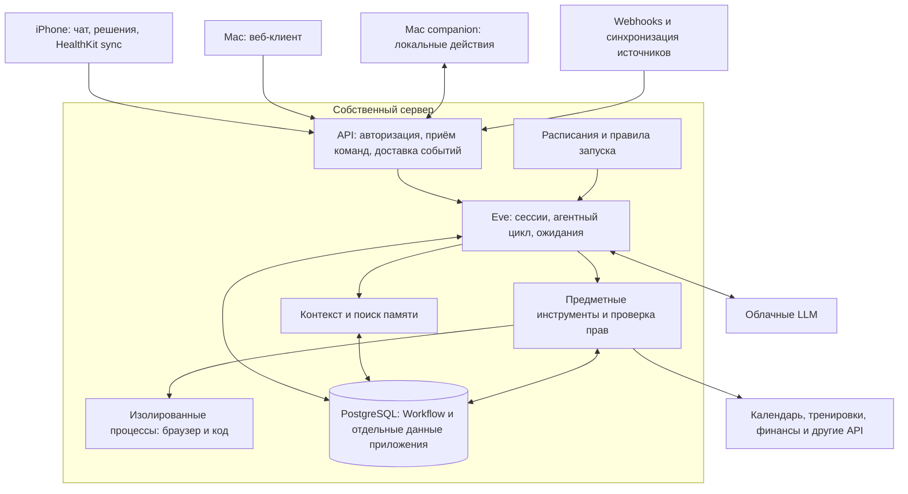

**Архитектура личного ассистента Majordomo — исследование и рекомендация**

Срез источников: 5 сентября 2026 года. Требования: один владелец, iPhone и Mac, постоянно доступный собственный сервер и собственная БД, облачные LLM допустимы, основной язык — TypeScript. Под «hermess» здесь понимается Hermes Agent от Nous Research.

Это исследование официальной документации и опубликованных исходников. Проекты не разворачивались; их надёжность под нагрузкой и после аварий не проверялась. Указанные ниже свойства проектов — документированные возможности, а предлагаемая архитектура и порядок реализации — моя инженерная рекомендация. Ветки main и документация изменяются: перед реализацией нужно закрепить конкретные совместимые версии.

**Рекомендация.** Строить собственное приложение с независимыми предметными данными, правилами действий и клиентами. Первым кандидатом на среду исполнения взять **Eve, использующий AI SDK, с PostgreSQL Workflow world**. Разместить Node-сервис и PostgreSQL на своём сервере. Для Mac начать с веб-клиента; для iPhone — React Native/Expo с нативным модулем HealthKit. Доступ к локальным возможностям Mac добавлять отдельным небольшим приложением по мере появления конкретных задач.

Причина выбора Eve: требуемая система включает долговечные сессии, ожидания, расписания, инструменты, каналы, sandbox и клиентов. Готовый каркас уменьшает объём собственного кода исполнения. Его beta-статус делает проверку восстановления и обновлений первым этапом выбора, до наполнения системы личными данными. Предметная модель остаётся своей независимо от результата этой проверки. [Eve: устройство проекта и beta-статус](https://github.com/vercel/eve), [самостоятельное размещение](https://github.com/vercel/eve/blob/main/docs/guides/deployment/self-hosting.md).

**Что дают референсы.** Эти шесть проектов находятся на разных уровнях: готовый ассистент, фреймворк, библиотека моделей и программируемая среда выполнения рабочих задач.

| Референс | Что подтверждено источниками | Что заимствовать / как использовать |
|---|---|---|
| Hermes Agent | Python-ядро, общий agent loop для нескольких интерфейсов, gateway, расширения, memory providers и skills. | Отбор компактной памяти и процедурные skills. Готовый альтернативный runtime, если Python приемлем. [Архитектура](https://hermes-agent.nousresearch.com/docs/developer-guide/architecture). |
| OpenClaw | Долгоживущий gateway, operator clients и отдельные device nodes с capabilities; typed WebSocket API. | Разделение центрального сервера, интерфейсов и локальных исполнителей. Сильный вариант, если достаточно расширить готового ассистента. [Gateway](https://docs.openclaw.ai/concepts/architecture). |
| Vercel AI SDK | TypeScript-инструменты для моделей, tool loop, контекста и потоковых ответов; текущая документация также описывает отдельную абстракцию harnesses. | Базовый модельный слой. При прямом использовании серверное состояние, фоновые задания и предметную память придётся организовать отдельно. [Agents](https://github.com/vercel/ai/blob/main/content/docs/03-agents/01-overview.mdx). |
| Vercel Eve | Сессии и шаги поверх Workflow SDK, инструменты, skills, каналы, расписания, изолированное исполнение; self-hosting документирован. | Основной кандидат для собственного приложения. Потребуются собственные интеграции, данные и настройки эксплуатации. [Модель исполнения](https://github.com/vercel/eve/blob/main/docs/concepts/execution-model-and-durability.mdx). |
| Codex | App Server с моделью thread/turn/item, событиями, steering, interrupt и approvals; SDK для автоматизации. | Устройство интерфейса управления работой; отдельный исполнитель задач по коду. Документация помечает команду app-server и WebSocket transport как experimental и unsupported для production workloads. Это не означает, что каждый метод протокола экспериментален. [App Server](https://learn.chatgpt.com/docs/app-server), [SDK](https://learn.chatgpt.com/docs/codex-sdk). |
| Claude Code / Agent SDK | Программируемый цикл Claude Code для TS/Python, tools, MCP, permissions, hooks, skills, subagents и sessions. | Отдельный исполнитель исследовательских/файловых задач; также возможен основной loop при выборе Claude. Для клиентов требуется собственный сервер вокруг SDK. [Обзор](https://code.claude.com/docs/en/agent-sdk/overview), [hosting](https://code.claude.com/docs/en/agent-sdk/hosting). |

OpenClaw логично сначала расширять плагинами, если его продуктовая модель устраивает. Форк оправдан конкретным препятствием. Его plugin API сейчас объявлен экспериментальным; тесно связывать с ним всё хранилище финансов и здоровья я бы не стал. [Плагины OpenClaw](https://docs.openclaw.ai/plugins/building-plugins).

Hermes хранит небольшую curated memory в MEMORY.md/USER.md, а историю отдельно в SQLite. У OpenClaw встроенная память также опирается на Markdown и отдельный поисковый индекс. Это полезные примеры разделения долговременных заметок и истории, но исходные измерения и транзакции разумнее хранить как структурированные данные. [Hermes memory](https://hermes-agent.nousresearch.com/docs/user-guide/features/memory), [OpenClaw memory](https://docs.openclaw.ai/concepts/memory).

**Постоянная активность — четыре разных свойства.** Сервер доступен круглосуточно; события и расписания запускают работу без открытого клиента; уже начатая работа восстанавливается после сбоя; результаты доходят до пользователя после возвращения устройства в сеть. Эти свойства нужно проектировать отдельно. Между событиями модель может вообще не вызываться.

Например, импорт тренировок работает обычным кодом. После появления новой тренировки сервер создаёт событие. Если оно соответствует настроенному правилу, запускается агент с необходимыми данными. После результата работа завершается либо переходит в сохранённое ожидание. Утренний обзор запускает расписание с часовым поясом пользователя. Точное напоминание доставляется обычным кодом и не должно ждать свободной LLM.

Наличие cron и сохранённого диалога само по себе не гарантирует восстановление каждого шага. Hermes документирует перевод прерванной cron-попытки в unknown без автоматического повторения. OpenClaw умеет восстанавливать ряд прерванных заданий, но прямо оговаривает, что уже начатые внешние действия этим не отменяются. У Claude SessionStore зеркалирование transcript может завершиться mirror_error с потерей конкретного batch и продолжением query. [Hermes cron](https://hermes-agent.nousresearch.com/docs/user-guide/features/cron), [OpenClaw automations](https://docs.openclaw.ai/automation/cron-jobs), [Claude hosting](https://code.claude.com/docs/en/agent-sdk/hosting).

**Предлагаемые части системы.** На старте это модульное приложение и несколько процессов инфраструктуры. Границы в коде не требуют отдельного микросервиса для каждой части.

| Часть | Ответственность | Что сохраняется |
|---|---|---|
| API и идентичность | Установить пользователя/устройство, принять команду, связать её с диалогом или задачей. | Устройства, подключения, идентификаторы принятых команд. |
| Agent runtime | Собрать контекст, вызвать модель, выполнить разрешённые tools, приостановить/продолжить работу. | Сессии и шаги в хранилище выбранного runtime. |
| Задачи и автоматизации | Цель пользователя, расписание/триггер, статус, результат, следующая проверка. | Долгосрочные обязательства ассистента. |
| Предметные модули | Тренировки, здоровье, финансы, календарь; проверяемые операции над ними. | Исходные записи, нормализованные значения, происхождение. |
| Память и контекст | Профиль, предпочтения, поиск прошлых событий и релевантных фактов. | Факты, ссылки на источники, версии, производные индексы. |
| Политики действий | Проверить конкретную операцию по ранее выданным правам и ограничениям. | Разрешения, решения пользователя, журнал внешних операций. |
| Локальные исполнители | Возможности, доступные только на устройстве. | Идентичность устройства, capabilities, результаты команд. |
| Наблюдаемость и доставка | Состояние системы, расходы, ошибки, уведомления. | Статусы запусков и доставки, технические метрики. |

**Разделение жизненных циклов.** Диалог — история общения. Задача — обязательство, которое может жить неделями и обсуждаться в нескольких диалогах. Запуск — конкретная попытка её выполнения. Шаг — вызов модели или инструмента внутри запуска. Операция — конкретное изменение внешнего мира. Устройство — клиент или исполнитель; его подключение не должно определять срок жизни задачи.

«Каждую неделю пересматривай мой план тренировок» должно стать задачей с расписанием, областью данных, правилами изменения плана и условиями уведомления. Задача ссылается на свои запуски и результаты. Одна запись в памяти о таком обещании недостаточна для исполнения.

Не нужно копировать внутреннюю историю Workflow в собственную вторую workflow-систему. В БД приложения сохраняются предметные задачи, ссылки на runtime sessions/runs, принятые команды и внешние операции. Выполненные шаги и durable waits остаются ответственностью runtime.

**Как организовать расширяемость.** Главные расширения — инструмент, подключение к источнику, skill и канал. Для первой версии достаточно обычных TS-модулей, схем входных данных и явного списка регистраций при сборке.

- Инструмент — узкая исполняемая операция: workouts.list, calendar.createEvent, memory.search. Схема описывает вход; код проверяет авторизацию и выполняет действие.
- Подключение — учётная запись внешнего сервиса, credentials, курсор синхронизации и связанные инструменты. Реализация API и данные пользователя принадлежат этому предметному модулю.
- Skill — процедура: как составлять недельный обзор или готовиться к встрече. Загружается по необходимости и использует уже существующие инструменты.
- Канал — преобразование сообщения/события конкретного интерфейса в общую команду и доставка результата обратно.

Пример добавления источника тренировок: добавить API-клиент, нормализовать записи в workouts, сохранить курсор импорта, предоставить workouts.list и настроить событие workout.imported. Агентный цикл и клиенты при этом менять не требуется, если существующих карточек и команд достаточно.

Для собственного кода обычно проще прямые typed tools. MCP полезен как стандартный интерфейс к внешним инструментам и отдельным процессам. Он не заменяет предметные проверки разрешений, повторов и согласованности данных. При удалённом MCP нужны отдельная авторизация и корректная работа с токенами; token passthrough запрещён рекомендациями протокола. [MCP security](https://modelcontextprotocol.io/docs/2025-11-25/tutorials/security/security_best_practices).

Права не выдаются через текст skill или содержимое памяти. Разрешение «можно отправить этот подготовленный текст этому адресату» должно проверяться исполняющим кодом. Для обычных разрешённых действий дополнительных подтверждений не нужно.

**Память состоит из нескольких видов данных.** Все они могут физически находиться в одной PostgreSQL, но имеют разную семантику.

| Вид | Примеры | Правила |
|---|---|---|
| Профиль и подтверждённые предпочтения | Часовой пояс, формат ответов, тренировочные цели. | Компактны, доступны для просмотра и исправления. |
| История взаимодействий | Сообщения, принятые решения, результаты задач. | Нужны для воспроизведения контекста и проверки происхождения фактов. |
| Предметные записи | Тренировки, сон, измерения, транзакции. | Источник, единицы, время события, время импорта, внешний ID, актуальность. |
| Извлечённые факты | «Предпочитает утренние тренировки». | Отличать слова пользователя от вывода модели; хранить источник и срок актуальности. |
| Процедуры | Как готовить обзор расходов или тренировок. | Версионировать как инструкции; проверять изменения на примерах. |
| Состояние работы | Ждём решения, следующий шаг, выполненные операции. | Хранить структурированно, отдельно от поиска по тексту. |

Сумму расходов, тренировочный объём и средние измерения вычисляет код/SQL. Модель объясняет результат. Для денежных значений хранить валюту и точное представление суммы; для измерений — единицы и исходный временной контекст. При импорте одной тренировки из двух систем нельзя просто складывать обе записи: нужен учёт исходного ID и происхождения.

Семантический поиск нужен для заметок и прошлых разговоров. Начать можно с полнотекстового поиска PostgreSQL; pgvector добавить, когда появляются реальные запросы по смыслу. Embeddings — перестраиваемый индекс. Удаление факта должно убрать его из активной памяти, производных сводок и индекса; политика удаления из резервных копий определяется отдельно. [pgvector](https://github.com/pgvector/pgvector).

Контекст на очередной ход собирается из небольшого профиля, текущей задачи, последних сообщений и найденных релевантных данных. Включать всю историю финансов и здоровья в каждый prompt дорого и мешает контролировать раскрытие данных. Запись вывода модели как устойчивого факта должна проходить отдельный этап: указать источник, проверить конфликт с существующим фактом, при необходимости пометить как гипотезу. Явное «запомни» можно сохранять сразу.

У Eve межсессионная память и состояние одной сессии — разные механизмы. MemoryProvider можно реализовать поверх своей БД. Особенность fileMemory(): без backend в eve dev это память процесса, на Vercel — private Blob, а в остальных окружениях требуется явная настройка. Название fileMemory не означает автоматическую запись на локальный диск. [Memory providers](https://github.com/vercel/eve/blob/main/docs/memory/overview.mdx), [backends fileMemory](https://github.com/vercel/eve/blob/main/docs/memory/file.md).

**Выполнение действий и восстановление.** Здесь находится основная сложность персонального ассистента, которому доверены реальные дела. Надёжная очередь не может сама обеспечить однократную отправку письма или создание бронирования во внешнем API.

Предлагаемый порядок для изменяющего инструмента:

1. Сохранить намерение с устойчивым operationId, параметрами и ссылкой на задачу.
2. Проверить текущие права и применимые ограничения. Если требуется решение пользователя, сохранить ожидание с точными параметрами операции.
3. После решения повторно проверить, что операция и разрешение ещё актуальны, затем выполнить её с тем же ключом идемпотентности, если API его поддерживает.
4. Сохранить внешний ID и подтверждённый результат. Повторный вызов с тем же operationId возвращает этот результат.
5. Если запрос ушёл, а ответ потерялся, установить состояние «результат неизвестен» и проверить внешний сервис. Когда проверить нельзя, остановить автоматическое повторение потенциально необратимого действия.

Локальная запись «начали отправлять» не доказывает ни отправку, ни её отсутствие. Подтверждение пользователя тоже не устраняет повтор при аварии. Отмена запуска останавливает будущие шаги; уже выполненное действие отменяется отдельной операцией, если сервис это позволяет.

При использовании Eve ожиданием и возобновлением владеет его механизм human-in-the-loop и requestId. Приложение связывает этот запрос с operationId, точными аргументами и предметным разрешением. Вторую независимую систему ожиданий строить не нужно. [Eve human-in-the-loop](https://github.com/vercel/eve/blob/main/docs/tools/human-in-the-loop.md).

В Eve завершённые durable steps восстанавливаются из записанного результата; прерванный шаг может выполниться заново. Это полезная механика восстановления, но идемпотентность изменяющих инструментов остаётся ответственностью приложения. [Eve: recovery](https://github.com/vercel/eve/blob/main/docs/concepts/execution-model-and-durability.mdx).

Ранее выданные разрешения удобно задавать по действию, адресату/ресурсу, лимиту и сроку. Например, чтение выбранных источников выполняется автоматически; разрешённое создание личных напоминаний — тоже; новый внешний платёж требует решения в рамках выбранной пользователем политики. Это избегает как постоянных запросов подтверждения, так и неограниченных полномочий.

**Безопасность — часть границ исполнения.** Интеграционные credentials доступны доверенному коду tools. Модель и исполняемый ею shell не получают общий набор секретов. Недоверенные страницы, письма и результаты MCP рассматриваются как данные, не как новые права или инструкции владельца. Политики проверяются непосредственно перед внешним эффектом, включая вызовы из subagents и фоновых задач.

Инструменты для вычислений и API выполняются в приложении; произвольный код и браузер — в отдельной изолированной среде с ограничениями файлов, сети и времени. Локальный доступ к Mac выдаётся по конкретным capabilities. Если Mac спит, задача получает состояние ожидания устройства; сервер не интерпретирует отсутствие ответа как успех.

Своя БД обеспечивает контроль над хранением, но выбранные данные из prompt всё равно уходят облачной LLM. Поэтому приложение должно управлять тем, какие категории данных доступны конкретной модели и инструменту, сокращать содержимое логов и уведомлений и позволять отключить источник. В push достаточно ID и нейтрального описания события; детали клиент запрашивает после авторизации.

**Клиенты iPhone и Mac.** Основное состояние живёт на сервере: закрытие приложения не отменяет работу. Клиент показывает диалоги, задачи, текущие действия, ожидаемые решения, память и свежесть источников. Результат запуска и факт его доставки — разные статусы.

Для Eve разумно сначала использовать его HTTP API и поток NDJSON, без второго собственного transport для тех же операций. Веб-клиент использует клиентскую библиотеку; мобильный клиент — проверенную реализацию протокола. Личные данные, список задач и настройки доступны через собственные предметные endpoints. Сопоставление внутреннего пользователя с runtime sessions хранится и проверяется сервером.

Eve предоставляет sessionId, управление сессией, поток событий и cursor для reconnect. Его command inbox не является универсальной durable FIFO-очередью: сообщения могут обрабатываться как steering или queue. Для обычных сообщений выбрать queue; команду «остановись и измени план» сделать явной. На входе из webhooks и при повторной отправке с мобильного клиента нужна дедупликация команд. В прототипе проверить, какие гарантии даёт выбранная версия, прежде чем добавлять собственный inbox. [Eve sessions and streaming](https://github.com/vercel/eve/blob/main/docs/concepts/sessions-runs-and-streaming.md).

Подтверждение с iPhone должно ссылаться на конкретный запрос, быть проверено сервером и отразиться на Mac. Повторное нажатие не должно запускать действие ещё раз. После разрыва связи клиент восстанавливает события с cursor либо перечитывает актуальный снимок. Если выбран OpenClaw, учитывать его иной контракт: WS events не воспроизводятся, после пропуска требуется refresh. [OpenClaw protocol](https://docs.openclaw.ai/concepts/architecture).

Для первой версии Mac достаточно React web/PWA. Отдельная оболочка оправдана локальными файлами, автоматизацией приложений, меню-баром или системными командами. iPhone-приложение на React Native/Expo сохраняет основную клиентскую разработку на TS, но HealthKit потребует нативного модуля/библиотеки и собственного build. Expo допускает локальную сборку и нативные модули; EAS не обязателен. [Expo: native code](https://docs.expo.dev/workflow/customizing/), [локальная сборка](https://docs.expo.dev/guides/local-app-development/).

**Apple Health влияет на архитектуру с самого начала.** HealthKit доступен приложению на устройстве и требует разрешений по типам данных. Веб-клиент и сервер сами не прочитают хранилище iPhone. Фоновое чтение может быть недоступно при блокировке устройства, поэтому нельзя обещать серверу непрерывный поток актуальных измерений. [Apple: privacy and data access](https://developer.apple.com/documentation/healthkit/protecting-user-privacy), [background delivery](https://developer.apple.com/documentation/Xcode/configuring-healthkit-access).

Предлагаемая синхронизация: HealthKit observer сообщает об изменении; anchored query получает новые и удалённые записи; приложение сохраняет пакет в локальную очередь; сервер атомарно принимает пакет и дедуплицирует записи; после подтверждения очередь продвигается. Курсор и пакет должны сохраняться согласованно, чтобы авария между чтением и отправкой не теряла данные. Синхронизация должна продолжаться при доступной следующей возможности, с догрузкой при открытии приложения. [Apple: anchored queries](https://developer.apple.com/documentation/healthkit/hkanchoredobjectquery).

Сервер хранит время последней успешной синхронизации и покрытый период. Отсутствие записей не равно отсутствию тренировки или нулевому показателю. Правила анализа учитывают неполные/устаревшие данные. Для push на iPhone используется APNs; сервер уведомлений может быть своим, но доставка всё равно проходит через Apple. Это внешняя зависимость выбранной платформы. [Apple User Notifications](https://developer.apple.com/documentation/usernotifications/).

**Проактивность без бесконечного расходования ресурсов.** У каждого повторяющегося правила должны быть триггер, область данных, разрешённые действия, часовой пояс, ограничение расходов и критерий уведомления. Обычные проверки свежести и порогов выполняются кодом; LLM вызывается для анализа, где он полезен.

Нужно различать точное напоминание, запланированный обзор и периодическую оценку открытых задач. Для просроченного задания после простоя заранее определить поведение: выполнить один раз сейчас, пропустить или пересчитать следующее время. Для одинаковых уведомлений сохранять ключ дедупликации. По умолчанию уведомлять о существенном изменении, завершении, сбое или необходимом решении; спокойные проверки не обязаны производить сообщения.

Пример: утром система проверяет свежесть сна, последних тренировок и календаря. Если данные полны, запускает анализ и предлагает изменение сегодняшней нагрузки. Если импорт задержался, сообщает об ограниченности данных только когда это мешает действию. Изменение календаря выполняется по уже выданным правам либо ждёт конкретного решения. Закрытый iPhone не мешает анализу; запрос решения остаётся на сервере.

**Subagents добавлять по задачам.** Начать с одного координатора. Домены «здоровье», «финансы» и «тренировки» сначала являются наборами данных и инструментов. Отдельный агент полезен, когда задаче нужны собственный контекст, набор возможностей или параллельная работа: исследовать покупки, обработать большой документ, подготовить отчёт, изменить код.

Подзадача получает ограниченный контекст, tools, бюджет и ожидаемый результат со ссылками на источники. Права не расширяются автоматически. Результат специалиста не становится подтверждённой памятью без проверки. Codex и Claude Agent SDK удобно подключать именно на такой границе — как исполнителей задач по коду/файлам, с отдельной рабочей средой.

**Конкретный начальный стек и альтернативы.**

| Область | Предлагаемый выбор | Обоснование |
|---|---|---|
| Сервер приложения | TypeScript, Node.js, Eve | Долгоживущий backend с существующим agent runtime. |
| Модели | AI SDK providers внутри Eve | Прямые cloud API, отдельные настройки модели и бюджета для задач. |
| Возобновляемое исполнение | Workflow SDK + совместимый PostgreSQL world | Собственное хранилище durable state; использовать встроенную очередь runtime. |
| Предметные данные | PostgreSQL, отдельная схема приложения | Проверяемые записи, транзакции, память и задачи. |
| Документы/артефакты | Каталог на постоянном диске с метаданными в БД | Достаточно для одного сервера; объектное хранилище при реальной потребности. |
| Поиск | PostgreSQL FTS; pgvector по необходимости | Меньше инфраструктуры, индекс можно перестроить. |
| Mac | React web/PWA | Быстрый доступ с компьютера, общий сервер. |
| iPhone | React Native/Expo + native HealthKit | TS для UI и общей логики, нативная граница для данных устройства. |
| Развёртывание | Docker Compose или systemd, reverse proxy/TLS | Один сервер, управляемые перезапуски и понятные резервные копии. |
| Исполнение браузера/кода | Отдельный sandbox backend | Отделить недоверенное исполнение от БД и credentials. |

Eve self-hosting допускает прямой model provider, Docker/microsandbox/custom sandbox, собственную аутентификацию и Workflow world. По умолчанию world хранится на диске; его нужно явно заменить/настроить для PostgreSQL. Документация требует совместимую линию Workflow и корректную маршрутизацию workflow callback endpoints. [Eve self-hosting](https://github.com/vercel/eve/blob/main/docs/guides/deployment/self-hosting.md).

В варианте Eve дополнительная pg-boss/Redis-очередь поверх той же работы изначально не нужна. У очереди и истории исполнения должен быть один ответственный механизм.

Если требуется сначала очень узкий ассистент с чатами и короткими периодическими заданиями, **AI SDK + PostgreSQL + pg-boss** — разумная самостоятельная альтернатива. pg-boss даёт задания, расписания и retries на существующей БД, но состояния ожидания и восстановление шагов агентного цикла придётся проектировать в приложении. Ретрай целого agent run может повторить его инструменты. [pg-boss](https://github.com/timgit/pg-boss).

Если длительные многошаговые процессы с ожиданиями и сложными обновлениями станут центральной частью продукта, а Eve окажется неподходящим, **AI SDK + Temporal** — более развитая альтернатива собственной orchestration-логике. Temporal поддерживает свой сервер и TS; модельные вызовы и внешние действия нужно оформлять как Activities с сохранёнными результатами и идемпотентностью. Он добавляет эксплуатационную нагрузку и не устраняет неопределённый результат внешнего запроса. [Temporal self-hosting](https://docs.temporal.io/self-hosted-guide), [Activities](https://docs.temporal.io/activities), [TypeScript SDK](https://github.com/temporalio/sdk-typescript).

Эти варианты являются альтернативами реализации одной ответственности. Их не следует одновременно вводить для одного цикла исполнения.

**Проверка выбранного каркаса перед основной разработкой.** Небольшой прототип Eve должен содержать один диалог с двух устройств, одно расписание, один читающий tool и один изменяющий tool в тестовом сервисе. На закреплённых версиях проверить:

1. Перезапуск процесса во время model call: работа восстанавливается или получает понятный статус; завершённые операции не повторяются.
2. Потерю ответа после внешнего изменения: тот же operationId не создаёт второй объект.
3. Перезапуск во время ожидания пользователя: запрос решения сохраняется и работает с другого клиента.
4. Два одновременных сообщения и два ответа на один запрос: ничего не теряется, действие происходит один раз.
5. Отключение клиента и reconnect: история и статус сходятся с сервером.
6. Простой во время расписания: применяется выбранное правило catch-up, уведомление не дублируется.
7. Обновление версии при незавершённой задаче: предусмотрено завершение на старой версии либо проверенная миграция; произвольный replay на новом коде не предполагается.
8. Восстановление из резервной копии: доступны задачи, память, артефакты, настройки и необходимые ключи доступа.

Это критерии следующего этапа, а не уже проведённые тесты. Если каркас не проходит их без большого слоя обходной логики, нужно пересмотреть выбор runtime до интеграции чувствительных источников.

**Порядок разработки после этой проверки.** Сначала сервер, диалоги, управление запусками, история решений и web UI. Затем один реальный источник данных и просмотр его свежести; для выбранных устройств — HealthKit sync и iPhone UI. Далее память с редактированием/удалением и несколько конкретных правил проактивности. После этого — изменяющие интеграции с учётом разрешений и повторов, локальные возможности Mac и ограниченные subagents.

Для эксплуатации достаточно начать с структурированных логов и метрик: последний успешный импорт, последний запуск каждого расписания, ожидаемые решения, неизвестные исходы операций, ошибки доставки и расходы на модель. Нужны регулярные резервные копии БД и артефактов с проверкой восстановления. Один сервер остаётся одной точкой отказа; способность продолжить работу после его восстановления не означает непрерывную доступность во время его простоя.

Скелет репозитория может быть небольшим: приложение сервера, web-клиент, mobile-клиент, общий пакет схем/API и предметные модули рядом с серверным кодом. Новые пакеты, отдельные сервисы, marketplace плагинов, графовая БД и постоянно работающая команда специализированных агентов оправдываются конкретными задачами после появления первой полезной версии.
